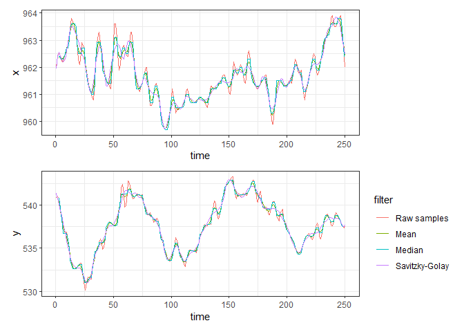
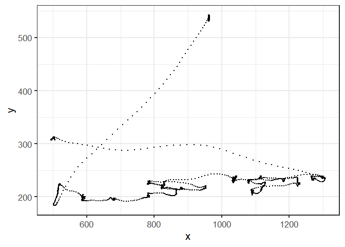

<!-- README.md is generated from README.Rmd. Please edit that file -->

# eyemovements

<!-- badges: start -->

<!-- badges: end -->

Tools for processing raw eye-tracking samples and detecting fixations
and saccades.

## Installation

You can install the package from Github by running the following code:

``` r
# Check if "devtools" is installed:
if('devtools' %in% rownames(installed.packages())==FALSE){
    install.packages('devtools')
    library(devtools)
  }else{
    library(devtools)
  }
devtools::install_github("martin-vasilev/eyemovements")
```

## Sample data:

The package has some in-built datasets to use as an example:

1.  `"Oz" dataset`, containing the raw samples of a participant reading
    a page from the “Little Wizard Stories of Oz” (Slattery & Vasilev,
    2019). Data was recorded with an Eyelink 1000+ at 1000 Hz
    (monocular, from the right eye):

``` r
library(eyemovements)
dat= data_Oz
str(dat)
#> 'data.frame':    32586 obs. of  4 variables:
#>  $ time : num  1322956 1322957 1322958 1322959 1322960 ...
#>  $ x    : num  962 962 962 962 962 ...
#>  $ y    : num  541 541 541 540 539 ...
#>  $ pupil: num  1753 1752 1749 1747 1746 ...
```

When using your own data, note that it should contain the same columns
(`time`, `x`, and `y`), **using the exact same spelling**. Binocular
data is not yet supported, but as a temporary solution, you can average
out the x and y positions of the two eyes, take just the right eye, or
run the data separately for each eye.

## Data smoothing

Before detecting events (saccades, fixations) it is usually helpful to
filter the raw gaze positions to reduce noise. The `SmoothSamples()`
function provides several algorithms for data smoothing such as
Mean/Median moving window, Savitzky-Golay, etc. The exact filter can be
specified with the `method` argument in the function (e.g., `Mean`,
`Median`, `SG`).

For mean/median filtering, you can provide the moving window size. For
data with high temporal resolution (e.g., 500-1000Hz), 5-sample moving
window tends to work well. This can be reduced to 3 for low-sampling
applications (though note that the value has to be odd).

``` r
# Moving average filtering:
filtered_dat_mean<- SmoothSamples(data = data_Oz, method = "Mean", window_size = 5)

# Moving median filtering:
filtered_dat_median<- SmoothSamples(data = data_Oz, method = "Median", window_size = 5)
```

Other filters such as Savitzky-Golay can also be used. Here, the filter
order (`p`) and length (`n`) need to be specified.

``` r
filtered_dat_SG<- SmoothSamples(data = data_Oz, method = "SG", p= 5, n= 23)
```



## Event detection (Saccades/ Fixations)

Below we outline the available methods in the package for detecting
fixations and saccades.

### Identification by Velocity Threshold (I-VT) method

One of the most common ways of identifying saccades/ fixations is based
on their velocities. This relies on the assumption that sample-to-sample
velocities are low during fixations but high during saccades.
Velocity-based algorithms typically use a velocity threshold (which can
be either fixed or adaptive). Samples that exceed the threshold are
deemed to be in a saccade, whereas samples that are under the threshold
are deemed to be in a fixation. The I-VT method uses a fixed velocity
threshold, which can be specified by the user.

Some saccade detection algorithms such as I-VT require the use of
degrees of visual angle (dva). For these to work, the degrees need to be
calculated for your design. For this you need to know:

- The physical monitor size in cm, provided as c(x, y) vector
- Screen resolution in pixels, provided as c(x, y) vector
- Viewing distance (in cm)- distance between the participant’s eye and
  the monitor

These can then be used in the `VisualAngle()` function to calculate the
dva per pixel:

``` r

deg<- VisualAngle(screen_size_cm = c(x = 53, y = 30),
  resolution_px = c(x = 1920, y = 1080),
  viewing_dist_cm = 82)
deg
#>   axis screen_cm resolution_px deg_per_px size_px   size_deg
#> 1    x        53          1920 0.01865554       1 0.01865554
#> 2    y        30          1080 0.01919689       1 0.01919689
```

Using the dva values above, we can parse the data for fixations/
saccades using the `IVT()` function. The function outputs fixations by
default (`return_saccade= FALSE`). However, saccade data can be
alternatively outputted by setting `return_saccades= TRUE`. The
sensitivity of the saccade detection algorithm is determined by the
`vel_threshold` argument (in degrees per second). By default, this is
set to 30 deg/s (same default that Eyelink uses for “cognitive
research”). If working with more oculomotor tasks (e.g.,
pro-saccade/anti-saccade), this can be set a bit higher (e.g., 35-40
deg/s). However, users can change it to any value. Please note that some
data smoothing is recommended before parsing the data to improve
performance of the algorithm. Sometimes the algorithm can detect very
short fixations, mostly due to noise. Users can specify the minimum
fixation duration to be detected (`min_fix_dur`). By default, this is
set to 50 ms (i.e., all fixations 0-49 ms are discarded). However, users
can turn it off if they prefer (`min_fix_dur= NULL`).

To detect fixations, we can put the desired arguments together with the
Oz data:

``` r
fix_IVT<- IVT(data = filtered_dat_mean,
          dva_x = 0.01865554,
          dva_y = 0.01919689,
          vel_threshold = 30,
          min_fix_dur = 50)

head(fix_IVT)
#> # A tibble: 6 × 8
#>   fix_id fix_start fix_end     x     y fix_dur avg_velocity n_samples
#>    <int>     <dbl>   <dbl> <dbl> <dbl>   <dbl>        <dbl>     <int>
#> 1      1   1322956 1323246  962.  538.     290         6.21       291
#> 2      2   1323316 1323536  516.  216.     220         6.47       221
#> 3      3   1323552 1323927  588.  197.     375         6.61       376
#> 4      4   1323947 1324166  680.  196.     219         6.34       220
#> 5      5   1324189 1324369  782.  202.     180         6.31       181
#> 6      6   1324389 1324534  865.  209.     145         6.21       146
```

The function outputs the following variables for fixations:

- `fix_id`: fixation ID in the detected sequence
- `fix_start`: start of fixation timestamp
- `fix_end`: end of fixation timestamp
- `x`: mean x pixel coordinate of the samples making up the fixation
- `y`: mean y pixel coordinate of the samples making up the fixation
- `fix_dur`: fixation duration (defined as `fix_end`- `fix_start`)
- `avg_velocity`: average velocity (in deg/s) of the samples making up
  the fixation
- `n_samples`: number of samples making up the fixation

To detect saccades, we can use the same arguments but set
`return_saccades` to `TRUE`. Note that the function still performs
filtering of very short saccades that are likely noise. This is done
with the `min_sacc_amplitude` argument. By default, saccades that are
shorter than 0.15 deg in amplitude are discarded (same default that the
Eyelink parser uses). However, this can be turned off by setting
`min_sacc_amplitude` to `NULL` or `0`.

``` r

sacc_IVT<- IVT(data = filtered_dat_mean,
          dva_x = 0.01865554,
          dva_y = 0.01919689,
          vel_threshold = 30, 
          return_saccades = TRUE)

head(sacc_IVT)
#> # A tibble: 6 × 12
#>   sacc_id sacc_start sacc_end sacc_dur x_start y_start x_end y_end
#>     <int>      <dbl>    <dbl>    <dbl>   <dbl>   <dbl> <dbl> <dbl>
#> 1       1    1323247  1323298       51    959.    534.  506.  184.
#> 2       2    1323537  1323551       14    524.    222.  583.  202.
#> 3       3    1323928  1323946       18    593.    193.  668.  198.
#> 4       4    1324167  1324188       21    680.    195.  774.  198.
#> 5       5    1324370  1324388       18    786.    206.  850.  202.
#> 6       6    1324535  1324544        9    861.    214.  832.  217.
#>   sacc_amplitude_deg avg_velocity_deg peak_velocity_deg n_samples
#>                <dbl>            <dbl>             <dbl>     <int>
#> 1             10.8              210.              350.         52
#> 2              1.17              81.6             123.         15
#> 3              1.42              77.6             114.         19
#> 4              1.75              81.9             129.         22
#> 5              1.20              65.3             104.         19
#> 6              0.535             58.1              72.6        10
```

The function outputs the following variables for fixations:

- `sacc_id`: saccade ID in the detected sequence
- `sacc_start`: start of saccade timestamp
- `sacc_end`: end of saccade timestamp
- `sacc_dur`: saccade duration (defined as `sacc_end`- `sacc_start`)
- `x_start`: horizontal gaze position at saccade onset, in pixels.
- `y_start`: vertical gaze position at saccade onset, in pixels
- `x_end`: horizontal gaze position at saccade offset, in pixels
- `y_end`: vertical gaze position at saccade offset, in pixels
- `sacc_amplitude_deg`: saccade amplitude in degrees of visual angle,
  computed from the horizontal and vertical displacement between saccade
  onset and offset
- `avg_velocity_deg`: mean sample-to-sample velocity during the saccade,
  in deg/s
- `peak_velocity_deg`: maximum sample-to-sample velocity during the
  saccade, in degrees/second
- `n_samples`: number of samples contributing to the saccade

### Identification by Dispersion Threshold (I-DT) method

An alternative to velocity-based methods is to use sample-to-sample
dispersion (i.e., how widely dispersed individual samples are in space).
This method relies on the assumption that dispersion will be low during
fixations because the eyes will oscillate around the same narrow area
and samples will be clustered closely in space. This can be easily by
plotting the raw x and y samples. The “blobs” of samples (where a lot of
them occur in the same small area) are the fixations.



The I-DT method works by starting with a minimum fixation window
(`window_threshold`), set in the package by default to 50ms for
compatibility with I-VT. The algorithm checks if the samples within the
fixation window exceed a fixed dispersion threshold (`disp_threshold`,
set by default to 1 deg). If this is not the case, then the window keeps
“growing” to the right by adding additional samples until the threshold
is exceeded. The fixation is then terminated and recorded. If the
initial window already exceeds the threshold, then the first sample is
removed on an iterative basis until the dispersion falls below the
threshold. The end point of the fixation is then determined by the same
process, as described above.

To detect fixations, we can use the `IDT()` function with the
mean-filter Oz data:

``` r
fix_IDT<- IDT(data = filtered_dat_mean,
          dva_x = 0.01865554,
          dva_y = 0.01919689,
          window_threshold = 50,
          disp_threshold = 1)

head(fix_IDT)
#>   fix_id fix_start fix_end        x        y fix_dur fix_dispersion_deg
#> 1      1   1322956 1323251 961.6485 537.5331     295          0.8317924
#> 2      2   1323289 1323372 511.6648 201.2226      83          0.9924649
#> 3      3   1323373 1323543 518.1750 219.4989     170          0.9103121
#> 4      4   1323545 1323929 588.2062 196.6942     384          0.9519623
#> 5      5   1323938 1324169 678.8529 195.5512     231          0.9501383
#> 6      6   1324179 1324308 780.8780 200.3995     129          0.9990617
#>   n_samples
#> 1       296
#> 2        84
#> 3       171
#> 4       385
#> 5       232
#> 6       130
```

The function outputs the following variables for fixations:

- `fix_id`: fixation ID in the detected sequence
- `fix_start`: start of fixation timestamp
- `fix_end`: end of fixation timestamp
- `x`: mean x pixel coordinate of the samples making up the fixation
- `y`: mean y pixel coordinate of the samples making up the fixation
- `fix_dur`: fixation duration (defined as `fix_end`- `fix_start`)
- `fix_dispersion_deg`: average dispersion (in deg) of the samples
  making up the fixation
- `n_samples`: number of samples making up the fixation

The `IDT()` function can also return saccades, which are defined as
intervals of non-fixations. To do so, `return_saccades` needs to be set
to `TRUE`. This is provided mostly for comparability purposes. However,
some caution needs to be exercised, as the I-DT method is not optimised
for saccade detection.

``` r

sacc_IDT<- IDT(data = filtered_dat_mean,
          dva_x = 0.01865554,
          dva_y = 0.01919689,
          window_threshold = 50,
          disp_threshold = 1, 
          return_saccades = TRUE)

head(sacc_IDT)
#> # A tibble: 6 × 11
#>   sacc_id sacc_start sacc_end sacc_dur x_start y_start x_end y_end
#>     <int>      <dbl>    <dbl>    <dbl>   <dbl>   <dbl> <dbl> <dbl>
#> 1       1    1323251  1323289       38    962.    538.  512.  201.
#> 2       2    1323372  1323373        1    512.    201.  518.  219.
#> 3       3    1323543  1323545        2    518.    219.  588.  197.
#> 4       4    1323929  1323938        9    588.    197.  679.  196.
#> 5       5    1324169  1324179       10    679.    196.  781.  200.
#> 6       6    1324379  1324380        1    785.    205.  861.  209.
#>   sacc_amplitude_deg avg_velocity_deg peak_velocity_deg
#>                <dbl>            <dbl>             <dbl>
#> 1             10.6              258.              350. 
#> 2              0.371             10.5              10.6
#> 3              1.38             121.              123. 
#> 4              1.69              88.4             114. 
#> 5              1.91             103.              129. 
#> 6              1.44              82.8              89.3
```

The function outputs the same saccade variables as I-VT (see above).
